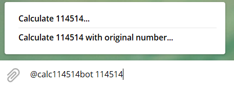
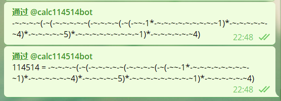

# Calc 114514 数字论证器

Calculate a number with `114514` &amp; some operators.

利用 `114514` 及一些运算符构造出所给的数字。

> 数字论证是一种常见的定理证明方法。
>
> 简单来说，就是对于给定的自然数，找出一个等值的表达式，如果该表达式去除所有符号部分后为字符串「114514」，则完成论证。表达式仅允许整数运算，可以使用括号、常见的代数运算符 `+-*/%` 和位运算符 `~^&|`。
>
> *Via: USTC Hackergame 2020*

**See also:**  [超精巧的数字论证器 (official writeup)](https://github.com/USTC-Hackergame/hackergame2020-writeups/blob/master/official/%E8%B6%85%E7%B2%BE%E5%B7%A7%E7%9A%84%E6%95%B0%E5%AD%97%E8%AE%BA%E8%AF%81%E5%99%A8/README.md)


## Demonstration method  论证算法

### 六位数以内论证方法

在不超过6位数，即 `0 <= num <= 999999` 的论证上，参考了官方 WriteUp 里的算法。

**重要性质：**

`-~x == x+1`  
`~-x == x-1` 对于任意 `x` 都成立。

> 一个办法就是**按照十进制的方式来凑**，即 `given_number = (((((((0+a)*10+b)*10+c)*10+d)*10)+e)*10)+f` ，其中 `a b c d e f` 为 0 到 9 之间的整数。表达式中的值 `0 10 10 10 10 10` 可以分别利用 `1 1 4 5 1 4` 与嵌套 `~-` 来凑出，而 `+a +b +c +d +e +f` 可以直接利用嵌套 `~-` 来实现（不需要使用数字）。

### 超过六位数的论证方法

对于所给整数`n`，采用与十进制类似的方法，在 $ n^{1/6} $ 附近取六个数，每位取不同进制，最后再凑到所给的数。

*（TODO）*


## FrontEnd  前端

前端在 Hackergame 2020 签到题的基础上魔改而成。

基于 Vercel 完成部署。

详见： [https://calc114514.vercel.app/](https://calc114514.vercel.app/?from=GitHub)

另外也部署到了 CloudFlare Pages:  

[https://114514.pages.dev/](https://114514.pages.dev/?from=GitHub)


## BackEnd  后端

后端使用 Python3 及 Flask 进行开发。

基于 Vercel 的 Serverless Function 完成部署。*（Serverless 真香！）*

### API 开放接口

> **GET / POST** https://calc114514.vercel.app/api/calc

**Param:**

`num` a number here.

`isJson` Optional. If `1`, return the result(s) with `JSON` format, else return `text/plain` result.

**Return:**

See examples below.

**Examples:**

```bash
$ curl "https://calc114514.vercel.app/api/calc?num=114514"
-~-~-~-~(-~(-~-~-~-~-~(-~-~-~-~(-~(-~~-1*-~-~-~-~-~-~-~-~-~1)*-~-~-~-~-~-~4)*-~-~-~-~-~5)*-~-~-~-~-~-~-~-~-~1)*-~-~-~-~-~-~4)

$ curl "https://calc114514.vercel.app/api/calc?isJson=1&num=114514"
{"answer":"-~-~-~-~(-~(-~-~-~-~-~(-~-~-~-~(-~(-~~-1*-~-~-~-~-~-~-~-~-~1)*-~-~-~-~-~-~4)*-~-~-~-~-~5)*-~-~-~-~-~-~-~-~-~1)*-~-~-~-~-~-~4)","number":"114514"}
```


### Telegram bot

See [@calc114514bot](https://t.me/calc114514bot).

**Usage:**

1. Send a number to @calc114514bot.
2. Use inline query method, `@calc114514bot <Number Here>` .



第一个不带原数，第二个带原数，效果分别如下所示。



### Development 开发说明

接口相关代码位于 `/api/` 目录下，`main.py` 内包含了开放接口和 bot 交互的相关接口。

bot 采用 Webhook 方式处理发来的消息。

1. Install the requirements.

   ```bash
   pip3 install -r requirements.txt
   ```

2. Edit your Telegram bot token and Webhook URL path in the `secret.example.py`.

3. Rename `secret.example.py` to `secret.py`.

4. Run the backend, for example, `gunicorn main:app`.

**基于 Vercel 部署：**

直接用 CLI 上传即可。


## Blog

**部署笔记：**  

[基于 Vercel Serverless 部署 Calc114514 API & Telegram bot | MiaoTony's 小窝](https://miaotony.xyz/2020/11/18/Server_Vercel_Calc114514/?from=GitHub)


## Copyright

**本项目相关技术内容仅供学习研究，请在合理合法范围内使用！**  
**The relevant technical content of this project is only for study and research, please use within the reasonable and legal scope!**

**License:**
[GNU Affero General Public License v3.0](https://github.com/miaotony/calc114514/blob/master/LICENSE)

最终解释权归本项目开发者所有。  
The final interpretation right belongs to the developer of the project.

Copyright © 2020-2023 [MiaoTony](https://github.com/miaotony).

